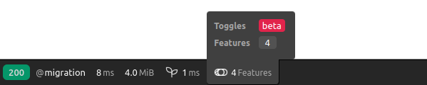
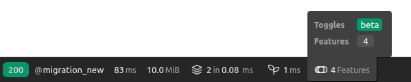
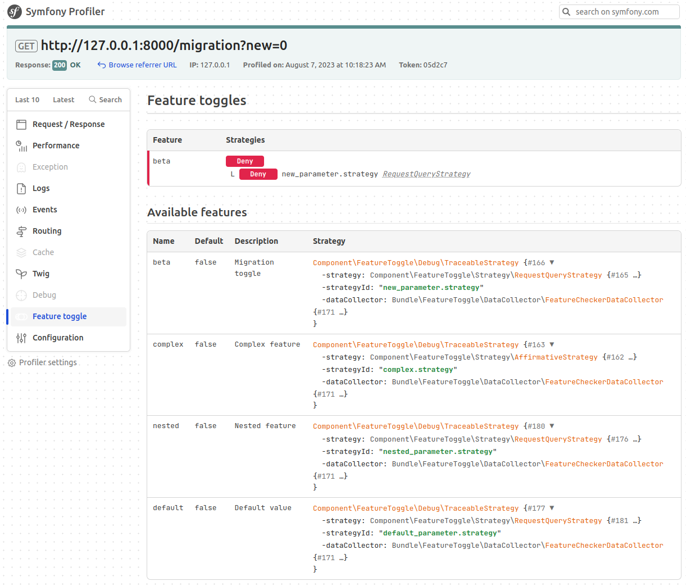
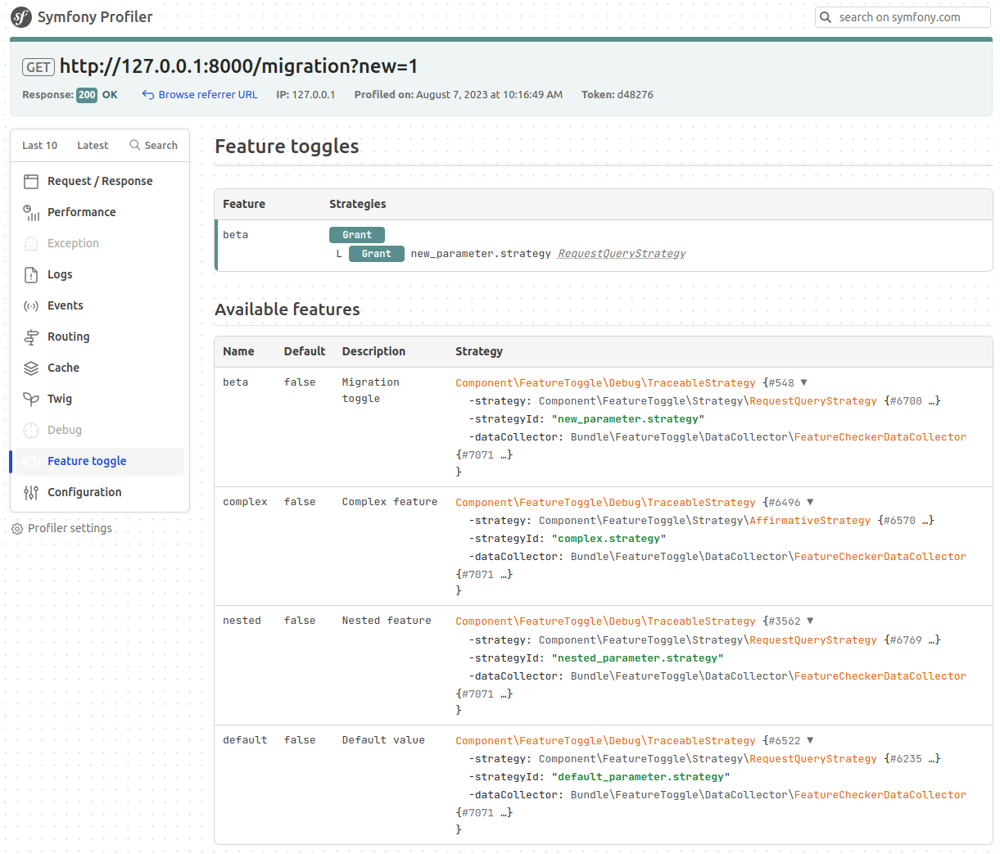
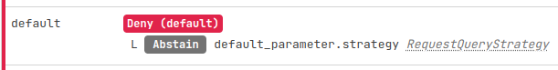
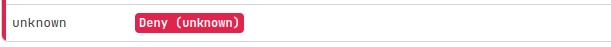
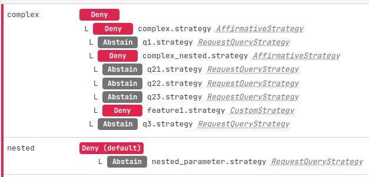
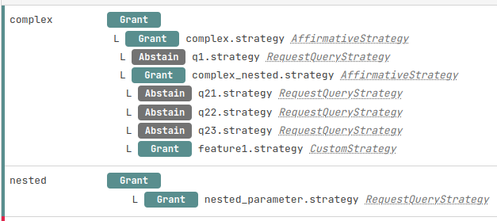

# FeatureToggle Component

## Introduction

There is no simple way (yet) to enable part of the source to be executed depending on certain context.
This PR tries to solve this issue by integrating some easy way to check is this or that feature should be enabled.

First check out (Martin Fowler's article)[https://martinfowler.com/articles/feature-toggles.html#De-couplingDecisionPointsFromDecisionLogic] about different use cases for feature toggling.
He categorize feature toggling like this :

- Experiment: show a beta version of your website to users who subscribed to.

- Release: deploy a new version of your code but keep the old one to compare them easily and rollback quickly if needed or control when a feature is released.

- Permission: grant access to a feature for paid accounts using the Security component.

- Ops: remove access to a consuming feature if server ressources are low (a k.a. kill switch). During Black Friday for example it is common to deactivate certain features for Ops because the load will be on other pages.

There are already some libraries / bundles out there but they either lack extensibility or are locked in to a SAAS tool (Unleash, Gitlab (which uses Unleash), ...).

- https://github.com/akeneo/pim-community-dev/tree/master/src/Akeneo/Platform/Bundle/FeatureFlagBundle
- https://medium.com/devwarlocks/implementing-feature-toggles-in-symfony-920993afd2b4
- https://smaine-milianni.medium.com/feature-flag-and-strategy-pattern-with-the-symfony-framework-7863ecc9556a

## Proposal
It is a simple Feature class that have a single Strategy instance. But strategy could be anything. At the moment this PR already provides a few. There can (should ?) be many more.
At the moment we simply check in headers, query string, with a start / end date.
There are also two combinators : Affirmative & Priority strategies which are heavily inspired by the AccessDecisionManager.

### As a standalone component
```php
use Symfony\Component\FeatureToggle\Feature;
use Symfony\Component\FeatureToggle\FeatureChecker;
use Symfony\Component\FeatureToggle\FeatureCollection;
use Symfony\Component\FeatureToggle\Strategy\AffirmativeStrategy;
use Symfony\Component\FeatureToggle\Strategy\DateStrategy;
use Symfony\Component\FeatureToggle\Strategy\RequestHeaderStrategy;
use Symfony\Component\FeatureToggle\Strategy\StrategyInterface;
use Symfony\Component\FeatureToggle\StrategyResult;
use Psr\Clock\ClockInterface;

$clock = new class() implements ClockInterface {
    public function now(): DateTimeImmutable
    {
        return new DateTimeImmutable();
    }
};

$collection = new FeatureCollection(features: [
    new Feature(
        name: 'christmas-banner',
        description: 'Special banner for christmas',
        default: false,
        strategy: new DateStrategy(
            $clock,
            DateTimeImmutable::createFromFormat('Y/m/d', $clock->now()->format('Y') . '/12/20'),
            DateTimeImmutable::createFromFormat('Y/m/d', $clock->now()->format('Y') . '/12/25'),
            includeFrom: true,
            includeUntil: true,
        ),
    ),
    new Feature(
        name: 'some-beta-feature',
        description: 'Has access to the "some beta feature".',
        default: false,
        strategy: new class() implements StrategyInterface {
            public function compute(): StrategyResult
            {
                // TODO: Fetch logic from database for example.
                return StrategyResult::Grant;
            }
        },
    ),
    new Feature(
        name: 'black-friday-banner',
        description: 'New banner for the incoming black friday with preview.',
        default: false,
        strategy: new AffirmativeStrategy([
            new DateStrategy($clock, new \DateTimeImmutable('14 Nov. 2023'), new \DateTimeImmutable('24 Nov. 2023'), true, false),
            new RequestHeaderStrategy('X-Preview-Black-Friday'),
        ]),
    ),
]);

$checker = new FeatureChecker(
    features: $collection,
    whenNotFound: true, // What happens when the feature does not exist
);

foreach ($collection as $feature) {
    echo sprintf("| %-20s | %10s |\n", $feature->getName(), $checker->isEnabled($feature->getName()) ? 'enabled' : 'disabled');
}
```

### As a bundle

Here are some configuration examples:

**Simple example**
```yaml
# features.yaml
framework:
    feature_toggle:
        strategies:
            -
                name: 'my_query.query.feature-strategy'
                type: 'native_request_query'
                with:
                    name: 'my_query'
        features:
            -
                name: 'my-feature'
                description: 'Desc feature 1'
                default: true
                strategy: 'my_query.query.feature-strategy'

```

**Advanced example**
```yaml
# features.yaml
framework:
    feature_toggle:
        strategies:
            -
                name: 'my_query.query.feature-strategy'
                type: 'native_request_query'
                with:
                    name: 'my_query'
            -
                name: 'some_attribute.request_stack.feature-strategy'
                type: 'request_attribute'
                with:
                    name: 'some_attribute'
            -
                name: 'my-custom.feature-strategy'
                type: 'Some\Service\Id'
            -
                name: 'priority_1.feature-strategy'
                type: 'priority'
                with:
                    strategies: ['my_query.query.feature-strategy', 'some_attribute.request_stack.feature-strategy', 'my-custom.feature-strategy']
        features:
            -
                name: 'my-feature'
                description: 'Desc feature 1'
                default: true
                strategy: 'priority_1.feature-strategy'

```

And here is how to use them:

**Inside any registered service**

```php
use Symfony\Component\FeatureToggle\FeatureCheckerInterface;

class MyService
{
    public function __construct(private FeatureCheckerInterface $featureChecker) {}

    public function doSomething()
    {
        if ($this->featureChecker->isEnabled('my-feature')) {
            // do stuff
        }
    }
}
```

**Using Twig**
```twig

    {# do stuff #}

```

**Using the Router component**
```yaml
my_route:
    # ...
    condition: 'isFeatureEnabled("myFeature")'
```
or using attributes
```php
#[Route(condition: 'isFeatureEnabled("myFeature")')]
```

To trigger those feature, using the Simple Configuration example above, you simply need to add `my_query` parameter and
set it to a truthy value (see [FILTER_VALIDATE_BOOL](https://www.php.net/manual/fr/filter.filters.validate.php#:~:text=FILTER_VALIDATE_BOOLEAN%2C%20FILTER_VALIDATE_BOOL)),
for example: http://my-website?my_query=1.

## Screenshots

### Toolbar (feature "beta")





### Panel





### Abstain (fallback to default)



### Unknown (fallback to default)



### Nested feature





## Future scope
### Have some kind of distribution system
For example "Enable this feature for 30% of visiting users.".
It requires the component to "calculate" a unique ID per visitor and check if a decision was already made (needs a storage).
* % of visiting users
* % of requests
* Gradual addition of users (10% for a month, 50% for next 6 months, 100% at 1 year)
* ...

### Full integration with any SAAS
Gitlab, like other SAAS, offers a way to enable / disable feature flags. It would be great to have it fully integrated using a simple `composer install`.

Some SAAS tools :
* Gitlab
* Unleash
* LaunchDarkly

### Add more strategies
* PHP-ext availability
* Package version (eg Container::willBeAvailable())
* PHP Version
* User property (using the Security component)
* Firewall in use (using the Security component)
* ROLES / IS_GRANTED (using the Security component)
* Path prefix
* RequestFormat. Ex: json, html, other
* Reverse proxy usage (Cloudflare / Varnish / Traefik / Caddy / Other)

### Ease the configuration / debugging with a string syntax
A way to configure it like so : `(header("plop") == "true" && getenv("MY_ENV") == true) || request_attribute("attr") == "plop"` or dumping a whole Feature configuration as the previous string to easily understand the logic.

### Distinguish compile & runtime available features
* getenv might be resolvable at compile time
  * :warning: might differ with CGI
* Headers will be resolvable at runtime only
* For a feature to be available at compile time all its inner strategies must be as well

### Make tests easier
* MockChecker

## Pending questions
* Change `$whenNotFound` to `bool|StrategyInterface $default` to apply a default strategy when feature not found.
